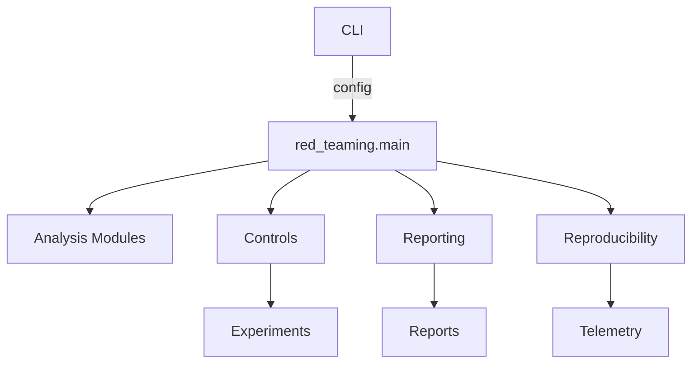

# ADR 0001: Adopt Canonical Safety Platform Structure

- Status: Accepted
- Date: 2024-03-10

## Context
The repository previously combined research notebooks, experiments, and scripts without a consistent layout. Tooling varied per directory, making reproducibility and automation difficult.

## Decision
Adopt a standardised layout with:
- Python package under `src/red_teaming`.
- Configurations in `configs/` and infrastructure assets in `infra/`.
- Unified script toolbelt plus Makefile façade.
- MkDocs documentation site with ADR index.
- GitHub Actions workflow executing `make check`.

Mermaid overview:

## Consequences
- Contributors rely on a predictable bootstrap and CI experience.
- Tests align with package structure, easing coverage triage.
- Additional languages (e.g. TypeScript) can be introduced without breaking the canonical scaffolding.
